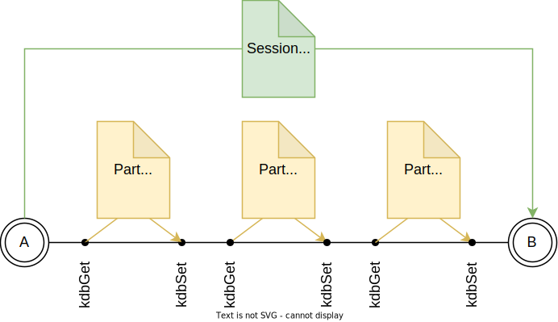

# Session Recording Technical Documentation

After every `kdbSet`, changes are calculated using Elektra's powerful changetracking API.
The result of the calculation is an `ElektraDiff` instance we'll call _part diff_ throughout this document.
The session recording plugin merges those _part diffs_ together and creates and persists an overall _session diff_.

Conceptually, this is depicted in the following image:

Importantly, the _session diff_ is shared across processes.
The _session diff_ persistently records all changes made to the whole KDB from any process between the start and end of the session.
Because of the cross-process nature of a _session diff_, it is also susceptible to "simultaneous write" conflicts.
We tried to limit the impact of these conflicts through locking.

All persistable namespaces are monitored for changes.

We currently have no way of recording changes done outside of Elektra, i.e. when the configuration files got edited manually.

## Storage of the Session Diff

The session diff is persisted in the respective namespace under `<namespace>:/elektra/record/session`.
I.e. all keys in the diff of the `system` namespace are under `system:/elektra/record/session`.

The recording plugin needs its own KDB instance to store the session diff within Elektra.
We provide hard-coded default mountpoints for the

- `dir:/elektra/record/session`,
- `system:/elektra/record/session`,
- `spec:/elektra/record/session` and
- `user:/elektra/record/session`
  keys.

These mountpoints store the keys in the `dump` format in a file called `record-session.cfg` in the respective standard directories for their namespace.

The following list describes some important keys:

- `/elektra/record/config/active`
  - If the key is present, session recording is active.
  - The keys value is the parent key of the session.
  - We will only record changes made to keys same or below of this parent key.
- `/elektra/record/session`
  - Contains all the recorded data.
  - Should be mounted into separate files in each namespace.
- `/elektra/record/session/diff/added`
  - Contains all added keys.
- `/elektra/record/session/diff/modified/old`
  - Contains the _old_ values and metadata for the keys that have been modified.
- `/elektra/record/session/diff/modified/new`
  - Contains the _new_ values and metadata for the keys that have been modified.
- `/elektra/record/session/diff/removed`
  - Contains all removed keys.

## Calculating the Session Diff

Keys in a diff are divided into different categories:

- Added: the key is new and did not exist before
- Modified: the key existed before and still exists but its value or metadata has been modified
- Removed: the key has been removed

Keys that stayed the same and therefore are not represented in a diff are called _unchanged_ keys in the following paragraphs.
The diagram below visualizes the state transitions when merging diffs.

The green ovals depict the state of a key in the session diff.
The arrows depict the actions/state of a key in the new part diff.

For example, if a key is in `Added` state in the session diff, and it is in `Removed` state in the new part diff, then the key will be unchanged in the new version of the session diff.
The transitions from `unchanged` to `Added`, `Modified` or `Removed` are not depicted, as they are quite trivial.

This functionality is quite generic and thus implemented as part of the normal diff API as `elektraDiffAppend`.

## Architecture

The core recording feature has two main components:

1. Recording C API (`libelektra-record`): Implements everything the tooling needs.
2. Recording Plugin (`libelektra-recorder`): Gets loaded as a hook plugin and calls the appropriate functions in `libelektra-record`.
